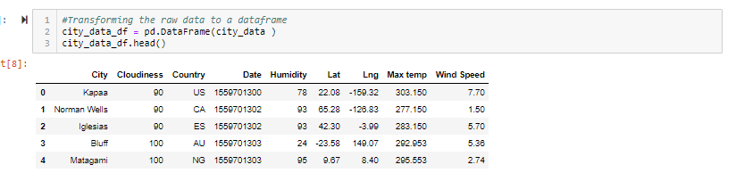
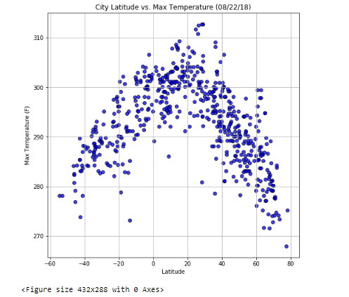
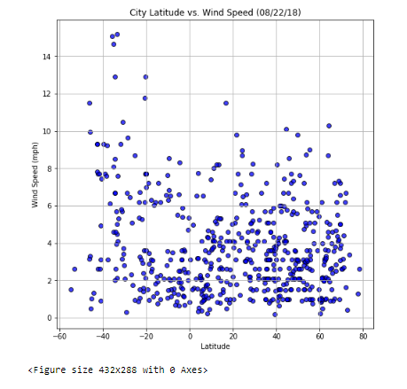

# WeatherPy (API)

I completed this project during my time at the [Columbia Engineering Data Analytics Bootcamp](https://bootcamp.cvn.columbia.edu/data/nyc/landing/?s=Google-Brand&pkw=%2Bdata%20%2Banalytics%20%2Bcolumbia&pcrid=392444639754&pmt=b&utm_source=google&utm_medium=cpc&utm_campaign=%5BS%5D_GRD_Data_Brand_ALL_NYC_BMM_New&utm_term=%2Bdata%20%2Banalytics%20%2Bcolumbia&utm_content=392444639754&s=google&k=%2Bdata%20%2Banalytics%20%2Bcolumbia&gclid=Cj0KCQiA2b7uBRDsARIsAEE9XpFH-2wU0-_7jtxCV_PCkGBR0prlyKtvpF2-nAWU1tO4oYci5h1QStsaAsg5EALw_wcB&gclsrc=aw.ds) located in New York, NY.

#### -- Project Status: [Completed]

## Project Description

The purpose of this project is to create a Python script to visualize the weather of 500+ cities across the world of varying distance from the equator. The script should make API request from the [OpenWeatherMap API](https://openweathermap.org/api) to collect the data and create scatter plots to showcase the following relationships: 

* Temperature (F) vs. Latitude
* Humidity (%) vs. Latitude
* Cloudiness (%) vs. Latitude
* Wind Speed (mph) vs. Latitude

Your final notebook must:

* Randomly select **at least** 500 unique (non-repeat) cities based on latitude and longitude.
* Perform a weather check on each of the cities using a series of successive API calls.
* Include a print log of each city as it's being processed with the city number and city name.
* Save both a CSV of all data retrieved and png images for each scatter plot.

## Methods Used
* API Requests 
* Data Analysis 
* Data Visualization

## Technologies
* Python (Pandas, Matplotlib, Numpy, Requests, Time, Jupyter Notebook)

## Output 

####  * Visit the final notebook: [WeatherPy (API)](https://github.com/CarolineDelva/WeatherPy-APIPython-Project/blob/master/starter_code/WeatherPy.ipynb) 

#### * Data Collection

#### * Temperature (F) vs. Latitude

#### * Humidity (%) vs. Latitude

#### * Cloudiness (%) vs. Latitude

#### * Wind Speed (mph) vs. Latitude

## Conclusion 

* As expected, the weather becomes significantly warmer as one approaches the equator (0 Deg. Latitude). More interestingly, however, is the fact that the southern hemisphere tends to be warmer this time of year than the northern hemisphere. This may be due to the tilt of the earth.
* There is no strong relationship between latitude and cloudiness. However, it is interesting to see that a strong band of cities sits at 0, 80, and 100% cloudiness.
* There is no strong relationship between latitude and wind speed. However, in northern hemispheres there is a flurry of cities with over 20 mph of wind.

